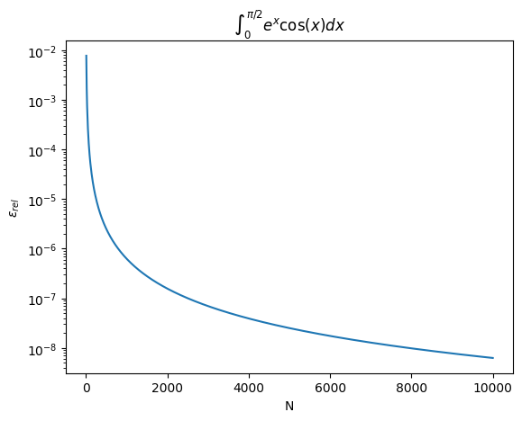

# Task 04 - Play with discrete math 

## 1. Source code (Python)

```python
import numpy as np
import matplotlib.pyplot as plt
from tqdm import trange 

def expcos(x):
    return np.exp(x)*np.cos(x)

def num_int(N:int,x_inf:float = 0.,x_sup:float = np.pi, out_file:str = "04-discrete-math/data.txt", fprint:bool = False, func:callable = expcos):
    samp_points = np.linspace(x_inf,x_sup,N)
    func_vals = np.array([func(x) for x in samp_points])
    
    np.savetxt(out_file, np.column_stack((samp_points,func_vals)), fmt="%.16f", header="x \t \t \t \t f(x)")
    res = np.trapezoid(func_vals,samp_points)
    if fprint:
        print(f"The resulting value of the integral for {N} samples is {res:.16f}")
    return res

def num_int_from_file(filename:str, fprint:bool = False,  func:callable = expcos):
    data = np.loadtxt(filename)
    samp_points = data[:,0]
    func_vals = data[:,1]
    N = len(samp_points)
    res = np.trapezoid(func_vals,samp_points)
    if fprint:
        print(f"The resulting value of the integral for {N} samples is {res:.16f}")
    return res


if __name__ == "__main__":
    N = np.linspace(10,10000,1000)
    x_inf = 0
    x_sup = np.pi/2
    epsrel = np.zeros(len(N))
    for its in trange(len(N)):
        I_res = num_int(round(N[its]),x_inf,x_sup)
        I_true = (np.exp(np.pi/2)-1)/2
        epsrel[its] = np.abs(I_res/I_true-1)

    
    plt.figure()
    plt.plot(N,epsrel)
    plt.title(r"$\int_0^{\pi/2}e^{x}\cos(x)dx$")
    plt.xlabel("N")
    plt.ylabel(r"$\epsilon_{rel}$")
    plt.yscale("log")
    
    plt.savefig("04-discrete-math/epsvN.pdf", format="pdf", bbox_inches="tight")
    
    # We check the num_int_fom_file 
    I_res_read = num_int_from_file("04-discrete-math/data.txt")
    assert np.abs(I_res_read-I_res) < 1e-8, f"The result obtained via reading the data file does not coincide. ({I_res} != {I_res_read})"
    
```

## 2. Questions
**I. The integral is analytic and its solution is $I_{true}=\frac{e^{\pi/2}-1}{2}$, how far are you from the real solution?**

The relative error depends on the number of discretization steps. A plot showing the results can be found below.



**II. How can you reduce the relative error?**

The most direct way would be to reduce the length of the discretization step or, equivalently, increasing the number of points used for the calulation. An alternative could be to use more sophisticated methods like Runge-Kutta.

**III. Which is the minimum relative error you can fund using the techniques you descrbed in point 2?**

The lowest relative error I've found corresponds to performing a discretization with $N=10^5$ equal length steps and is of order $\epsilon_{rel} \sim 10^{-8}$.